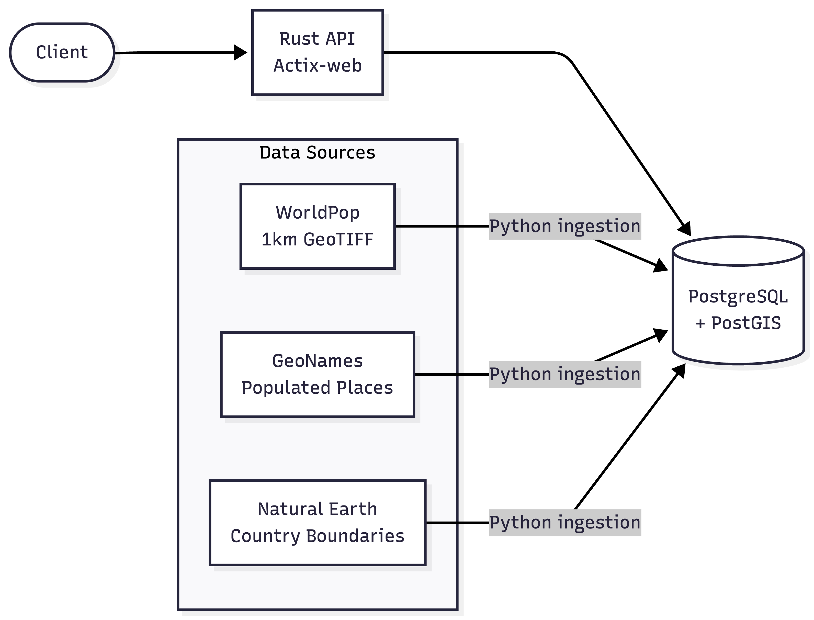
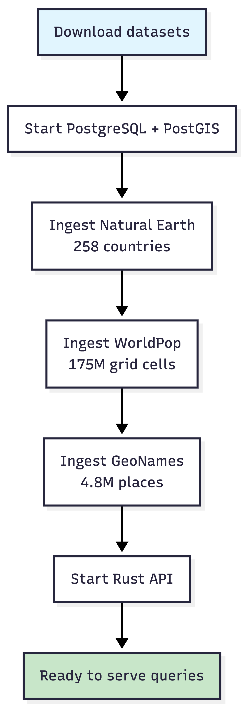
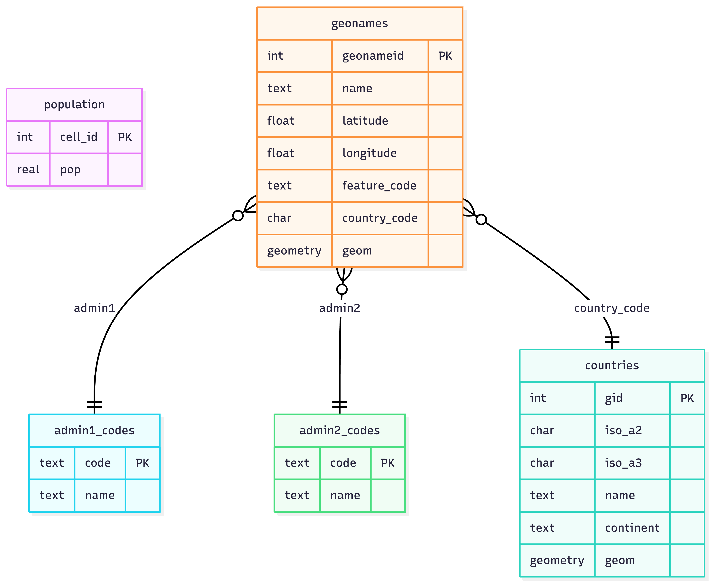

# GeoPop

**High-performance global population & geocoding API** backed by PostGIS, Rust, and open datasets.

Query any coordinate on Earth and get back population estimates, reverse geocoding, country info, and disaster risk exposure analysis — all in under 50ms for typical requests.

---

## Features

- **Population lookup** — 1km resolution grid covering the entire globe (175M+ cells)
- **Batch queries** — up to 1,000 coordinate lookups in a single request
- **Reverse geocoding** — nearest populated place from 4.8M+ GeoNames entries
- **Exposure analysis** — population within a radius for disaster risk assessment
- **Country lookup** — point-in-polygon and ISO code lookup with Natural Earth boundaries
- **Swagger UI** — interactive API docs at `/swagger-ui/`

## Architecture



## Data Pipeline



## Database Schema



## Quick Start

### Prerequisites

- Docker & Docker Compose
- Python 3.10+ (for data ingestion)
- ~5 GB disk space (database + downloaded data)

### 1. Clone and configure

```bash
git clone https://github.com/your-username/geopop.git
cd geopop
cp .env.example .env
```

### 2. Full automated setup

```bash
make setup
```

This downloads all datasets, starts the database, runs ingestion, and starts the API. The WorldPop download (~723 MB) and ingestion (~175M rows) takes about 30–45 minutes depending on your connection and hardware.

### Or step by step

```bash
# Download datasets
make download-all

# Start database
make db-up

# Ingest data (order matters: Natural Earth → WorldPop → GeoNames)
make ingest-all

# Start all services
make up
```

### 3. Verify

```bash
make test
```

The API is available at `http://localhost:8080` and Swagger UI at `http://localhost:8080/swagger-ui/`.

## API Endpoints

### `GET /population`

Population at a single coordinate (1km grid cell).

```bash
curl "localhost:8080/population?lat=51.5074&lon=-0.1278"
```

```json
{
  "lat": 51.5074,
  "lon": -0.1278,
  "population": 5765.2,
  "resolution_km": 1.0
}
```

### `POST /population/batch`

Batch lookup for up to 1,000 coordinates.

```bash
curl -X POST "localhost:8080/population/batch" \
  -H "Content-Type: application/json" \
  -d '{"points":[{"lat":51.5074,"lon":-0.1278},{"lat":35.6762,"lon":139.6503}]}'
```

### `GET /reverse`

Nearest populated place (reverse geocoding).

```bash
curl "localhost:8080/reverse?lat=35.6762&lon=139.6503"
```

```json
{
  "place_id": 1850147,
  "name": "Tokyo",
  "display_name": "Tokyo, Tokyo, Japan",
  "address": {
    "city": "Tokyo",
    "state": "Tokyo",
    "country": "Japan",
    "country_code": "jp"
  }
}
```

### `GET /exposure`

Population exposure within a radius — useful for disaster risk assessment.

```bash
curl "localhost:8080/exposure?lat=40.7128&lon=-74.006&radius=10"
```

```json
{
  "coordinate": { "lat": 40.7128, "lon": -74.006 },
  "radius_km": 10,
  "total_population": 3847291.5,
  "area_km2": 314.16,
  "density_per_km2": 12245.5,
  "places": [ ... ]
}
```

### `GET /country`

Country containing a coordinate.

```bash
curl "localhost:8080/country?lat=48.8566&lon=2.3522"
```

### `GET /country/{iso3}`

Country details by ISO 3166-1 alpha-3 code.

```bash
curl "localhost:8080/country/FRA"
```

### `GET /countries`

List countries by continent.

```bash
curl "localhost:8080/countries?continent=europe"
```

### `GET /health`

Service health check.

```bash
curl "localhost:8080/health"
```

## Performance

| Endpoint           | Typical Latency | Strategy                                     |
| ------------------ | --------------- | -------------------------------------------- |
| `/population`      | ~2ms            | B-tree lookup on `cell_id`                   |
| `/reverse`         | ~5ms            | GiST index nearest-neighbor                  |
| `/exposure` (10km) | ~20ms           | `generate_series` grid scan + GiST geography |
| `/exposure` (50km) | ~100ms          | Same strategy, more cells                    |
| `/country`         | ~10ms           | `ST_Contains` with GiST index                |

Key optimizations:

- **Integer cell_id** — population lookups are B-tree `O(log n)` on 175M rows, not spatial queries
- **Geography GiST index** — `ST_DWithin` on GeoNames uses a dedicated `(geom::geography)` index
- **JIT disabled** — PostgreSQL JIT compilation adds ~700ms overhead on first query; disabled for consistent sub-50ms responses
- **Connection pooling** — `deadpool-postgres` with `RecyclingMethod::Fast`

## Data Sources

| Dataset       | Source                                                                                 | Size    | Records       |
| ------------- | -------------------------------------------------------------------------------------- | ------- | ------------- |
| WorldPop      | [worldpop.org](https://www.worldpop.org/) — R2024B 2025 unconstrained UN-adjusted 1km  | ~723 MB | 175M cells    |
| GeoNames      | [geonames.org](https://www.geonames.org/) — allCountries, filtered to populated places | ~380 MB | 4.8M places   |
| Natural Earth | [naturalearthdata.com](https://www.naturalearthdata.com/) — 10m Admin 0 countries      | ~5 MB   | 258 countries |

## Project Structure

```
geopop/
├── api/                    # Rust API server
│   ├── src/
│   │   ├── main.rs         # Server setup, routes, connection pool
│   │   ├── config.rs       # Environment configuration
│   │   ├── grid.rs         # Cell ID computation (30 arc-second grid)
│   │   └── handlers.rs     # Endpoint handlers
│   ├── Cargo.toml
│   └── Dockerfile
├── docker/                 # Database container
│   ├── Dockerfile.db
│   ├── init.sql            # Schema, indexes, functions
│   └── postgresql.conf     # Tuned for population workload
├── ingestion/              # Data download & ingestion scripts
│   ├── download_worldpop.sh
│   ├── download_geonames.sh
│   ├── download_naturalearth.sh
│   ├── ingest.py           # WorldPop GeoTIFF → population table
│   ├── ingest_geonames.py  # GeoNames → geonames + admin tables
│   ├── ingest_naturalearth.py  # Shapefile → countries table
│   └── requirements.txt
├── docker-compose.yml
├── Makefile
└── .env.example
```

## Configuration

All configuration is via environment variables (see `.env.example`):

| Variable            | Default  | Description                                        |
| ------------------- | -------- | -------------------------------------------------- |
| `POSTGRES_USER`     | `geopop` | Database username                                  |
| `POSTGRES_PASSWORD` | `geopop` | Database password                                  |
| `POSTGRES_DB`       | `geopop` | Database name                                      |
| `DB_PORT`           | `5432`   | Host port for PostgreSQL                           |
| `API_PORT`          | `8080`   | Host port for the API                              |
| `POOL_SIZE`         | `16`     | Connection pool size                               |
| `DATABASE_URL`      | —        | Full connection string (overrides individual vars) |

## Development

```bash
# Build API locally (requires Rust)
make api-build

# Run smoke tests
make test

# Benchmark (requires 'hey')
make bench

# View logs
make logs

# Full cleanup
make clean
```

## License

MIT
